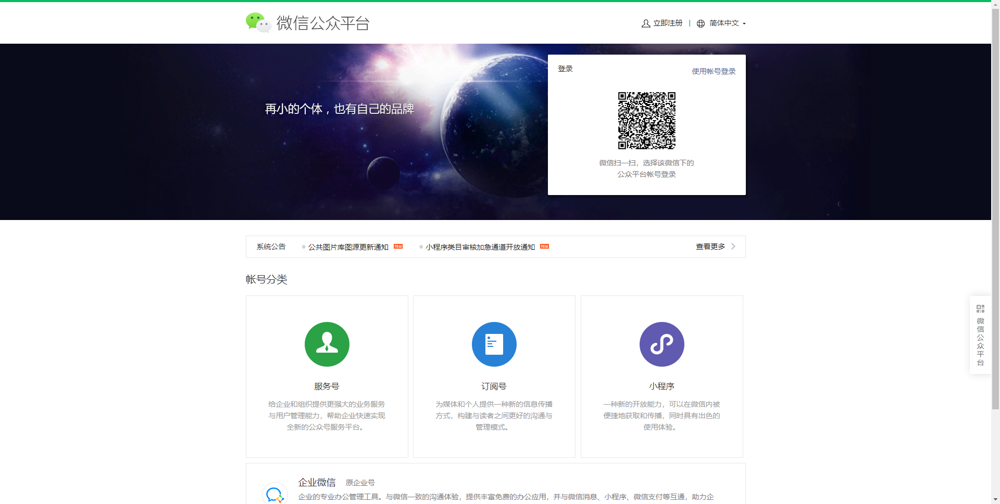
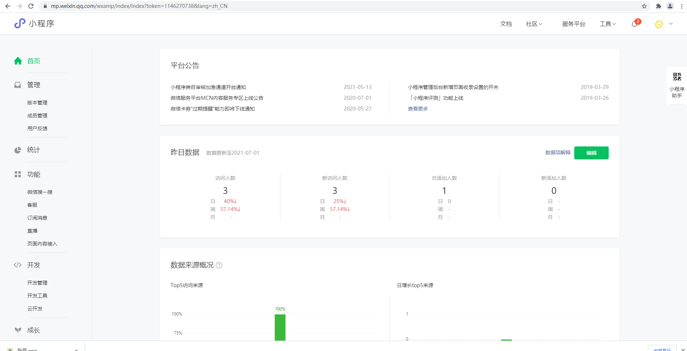
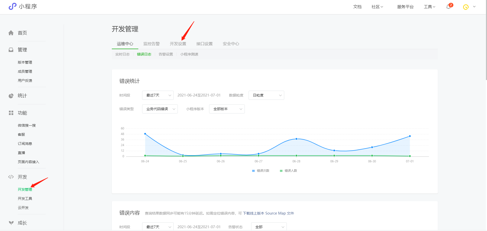
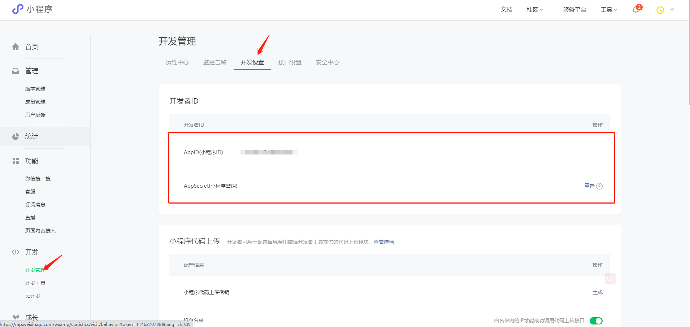
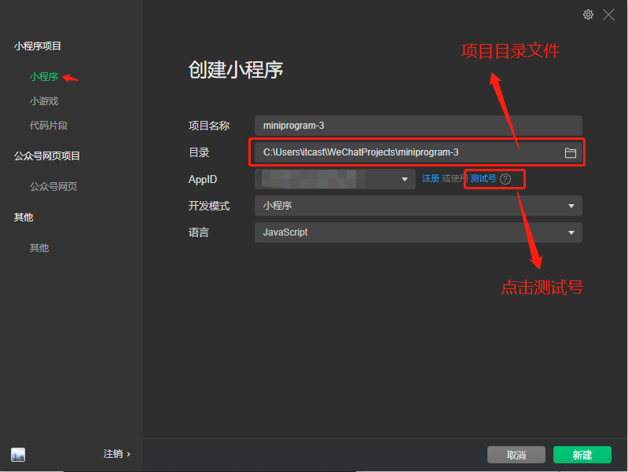

# 轻骑 V1.0 小程序流程说明

### 注册小程序AppID相关流程

---百度搜索[微信公众平台](https://mp.weixin.qq.com/),没有账号需要进行注册，进行扫码登录



找到开发管理





**注意：** appid生成，项目开发过程中要使用，或者临时使用测试号（后边介绍）



- ### Taro 介绍

  ### 简介

  **Taro** 是一个开放式跨端跨框架解决方案，支持使用 React/Vue/Nerv 等框架来开发 [微信](https://mp.weixin.qq.com/) / [京东](https://mp.jd.com/?entrance=taro) / [百度](https://smartprogram.baidu.com/) / [支付宝](https://mini.open.alipay.com/) / [字节跳动](https://developer.toutiao.com/) / [QQ](https://q.qq.com/) 小程序 / H5 / RN 等应用。

  现如今市面上端的形态多种多样，Web、React Native、微信小程序等各种端大行其道。当业务要求同时在不同的端都要求有所表现的时候，针对不同的端去编写多套代码的成本显然非常高，这时候只编写一套代码就能够适配到多端的能力就显得极为需要。
  
  ### **环境搭建**
  
  安装编辑器VS Code （Visual Studio Code）稳定版即可 [下载地址](https://code.visualstudio.com/download)
  
  安装微信开发者工具  [下载地址](https://developers.weixin.qq.com/miniprogram/dev/devtools/download.html)
  
  

### 安装依赖

```bash
$ npm i -g @tarojs/cli@3.2.8
$ npm install
```

### 运行

```bash
$ npm run dev:weapp
```

### 打包

```bash
$ npm run build:weapp
```

### 运行项目

在微信开发者工具里运行：

打开微信开发者工具


**注意：**

需要先配置**AppID**,选择测试号（**请阅读小程序AppID相关流程**）



点击新建


然后就可以浏览小程序


### 页面结构

- #### 项目目录结构[#](http://taro-docs.jd.com/taro/docs/tutorial#项目目录结构)

  ├── dist                   编译结果目录

  ├── config                 配置目录

  |   ├── dev.js             开发时配置

  |   ├── index.js           默认配置

  |   └── prod.js            打包时配置

  ├── src                    源码目录

  |   ├── pages              页面文件目录

  |   |   ├── index          index 页面目录

  |   |   |   ├── index.js   index 页面逻辑

  |   |   |   └── index.css  index 页面样式

  |   ├── app.css            项目总通用样式

  |   └── app.js             项目入口文件

  └── package.json