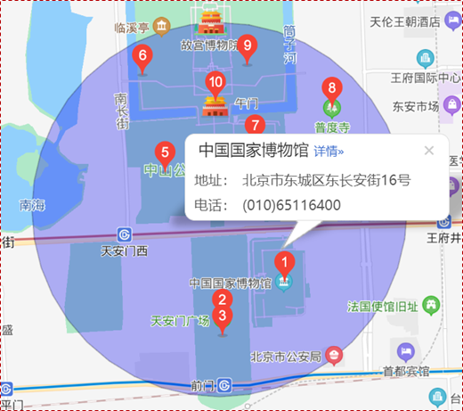

## 地图专题课程

## 1、百度地图基础API

百度地图基础API的主要功能如下：

- 创建地图
  

- 添加覆盖物

  

- 地图事件
  

- 地图样式
  

- 地图检索
  

- 数据可视化
  

- 地点输入提示
  

- 路线规划
  

## 2、百度地图鹰眼轨迹服务

鹰眼是一套轨迹管理服务，提供各端SDK和API供开发者便捷接入，追踪所管理的车辆/人员等运动物体。

主要功能：

## 3、地图找房

业务流程：

效果：

## 4、轻骑项目

### 4.1、小程序授权登录

小程序可以通过微信官方提供的登录能力方便地获取微信提供的用户身份标识，快速建立小程序内的用户体系。

### 4.2、骑行功能

开始骑行：

 

停止骑行：

 

### 4.3、上报地理位置

## 5、金运物流项目

### 5.1、订单管理

在订单管理功能中，主要是为前端提供起始位置，前端通过js调用百度地图api规划路线。

### 5.2、运单管理

运单管理中的轨迹是通过后端实现的，并且可以添加途经点。

 

### 5.3、电子围栏

通过设置多边形的电子围栏对车辆进行监控，如果超出范围就会进行告警。

> **原理：在百度地图中创建电子围栏，车辆作为Entity添加到围栏中进行监控。**

 

## 6、高并发解决方案

高并发的解决方案，核心是采用Netty作为服务端接收用户请求，然后将数据发送到Kafka集群。

## 7、海量数据存储解决方案

海量数据的存储方案，核心是采用Mongodb分片式集群进行数据存储。